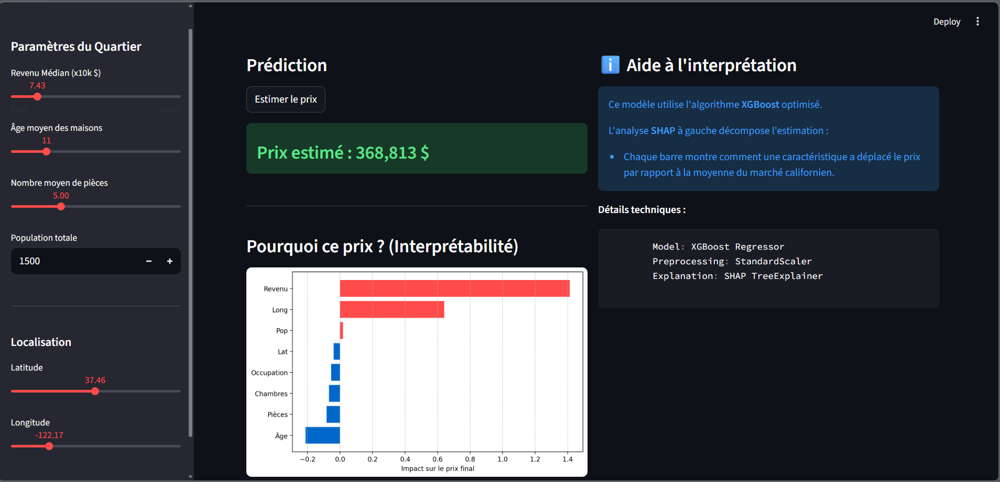

#  California House Pricing Predictor Pro
> **End-to-End Real Estate Valuation System with Explainable AI (XAI)**


##  Project Overview
This project transforms complex California census data into a transparent decision-making tool. Unlike traditional "black box" models, this predictor **statistically justifies every estimation** using SHAP (Shapley Additive Explanations) to build user trust and provide actionable insights.
## App Preview

##  Technical Highlights
* **Production Pipeline**: Full automation of preprocessing (StandardScaler) integrated into a Scikit-Learn Pipeline to ensure reproducibility and prevent data leakage.
* **State-of-the-art Algorithm**: Powered by **XGBoost** for its superior performance on structured data and ability to capture non-linear geographic relationships.
* **Explainable AI (XAI)**: Real-time integration of **SHAP** values to decompose the influence of each variable (income, age, location) on the final price.
* **Multilingual UI**: Fully interactive dashboard with a toggle between **English and Français** for global accessibility.

---

## Project Structure
* `src/pipeline.py`: Core engine for data loading, preprocessing, and model training.
* `app.py`: Interactive user interface developed with Streamlit.
* `notebooks/`: Exploratory Data Analysis (EDA) and model interpretation experiments.
* `models/housing_model.pkl`: Serialized production-ready model.

---

##  Installation & Execution

1. **Clone the repository**:
   ```bash
   git clone [https://github.com/your-username/California-House-Pricing.git](https://github.com/your-username/California-House-Pricing.git)
   cd California-House-Pricing
